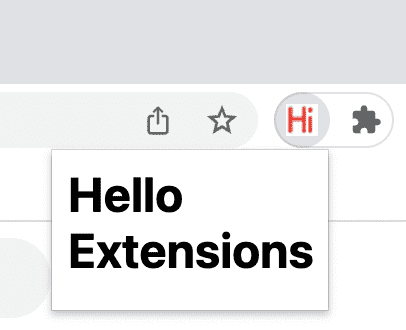

# Hello Extensions
*Notes on Creating my first Chrome Extension*
## Description
This extension displays "Hello Extensions" when user clicks on the extension toolbar icon as follows.
👇👇👇

## Procedure
A step by step guide to recreating this Chrome extension

### **Step 1**
Create a `manifest.json` file with the following:

{
    
    "name": "", 
    
    "description": "",
    
    "version": "",
    
    "manifest_version": ,
    
    "action": {
    
        "default_popup": "",
    
        "default_icon": "" 
    
    }

}

### **Step 2**
Create a `_.html` file for the `default_popup` section

## An example of an Extension Project Structure
|__ projectdirectory/
    |__ manifest.json
    |__ background.js
    |__ scripts/
        |__ content.js
        |__ react.production.min.js
    |__ popup/
        |__ popup.html
        |__ popup.js
        |__ popup.css
    |__ images/
        |__ iconX.png